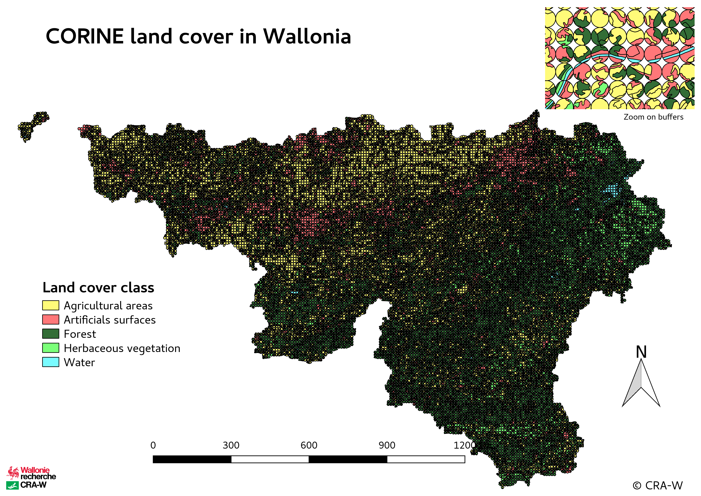
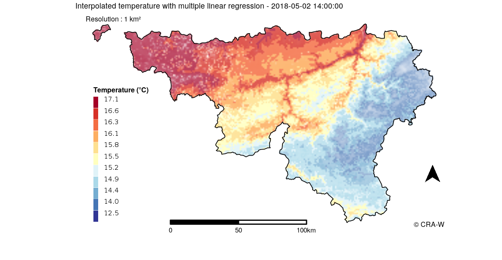

```{r include=FALSE}
load("~/Documents/code/internship-presentation/data/env_data_presentation.RData")
```

# 1. Préparation de l'environnement de travail
## 
* Installation de Linux

* Utilisation de Docker : Permet de créer un environnement de travail isolé où la configuration y est différente de l'ordinateur et où la configuration du Docker est la même pour tous ses utilisateurs

* Utilisation de GitHub : service d'hébergement de gestion des versions des fichiers -> permet de travailler collaborativement sur un même code

# 2. Récolte des données   

## 2.1. Données d'occupation du sol

* CORINE Land Cover : données de [Copernicus](https://land.copernicus.eu/pan-european/corine-land-cover/view) accessibles sur le [géoportail belge](https://www.geo.be/#!/catalog/details/bcd19aa9-c320-4116-971b-6e4376137f13?l=en)

* 47 classes dont 26 présentes en Wallonie -> regroupement en 5 classes : Zones artificielles, Zones de cultures, Zones herbacées, Forêt et Plans d'eau

* Récupération des données CLC aux stations (physiques et virtuelles) : réalisation de zones tampons autour des stations et calcul de la part de présence de chaque classe dans la zone

----

```{r echo=FALSE}
head(class.buff.clean.df)
```

----

{width=60%}

## 2.2. API AGROMET

* 29 stations du réseau PAMESEB

* Accès à des données dynamiques horaires : __température__, humidité relative, humectation du feuillage, __ensoleillement__

* 27 stations utilisables si on prend l'ensoleillement

## 2.3. API ensoleillement

* Rayonnement solaire : données [EUMETSAT](https://landsaf.ipma.pt/en/products/longwave-shortwave-radiation/dssf/) récupérées sur une API

* Données horaires, 875 points répartis sur la Wallonie -> insuffisant pour la précision souhaitée d'1 km² (~ 17000 points)

* Spatialisation des données solaires à l'aide d'une méthode de krigeage

## 2.4. Modèle Numérique de Terrain

* Données SRTM pour récupérer l'altitude avec une résolution de 90m puis calcul de la pente, l'orientation et la rugosité du terrain avec R

* Données très volumineuses = Temps de calcul important

# 3. Organisation des données

* Données statiques : CLC et MNT

```{r echo=FALSE}
head(expl.static.stations.df)
```

* Données dynamiques : récupération sur les API des données (température et ensoleillement)

----

Puis fusion de ces données en un seul tableau de données. Mais peu lisible car beaucoup de lignes (nb stations X nb heures récupérées) et non intégrable dans `mlr`.

-> Création de "nested data frames"

{width=40%}


# 4. Modélisation

## 4.1. Machine learning

_Définition_ : Le Machine Learning est un concept stipulant qu’il existe des algorithmes génériques pouvant nous révéler des informations intéressantes sur des données, sans avoir besoin de construire ou de développer un code spécifique. Au lieu d’écrire du code, vous nourrissez donc ces algorithmes avec des données qui leur permettront de construire leurs propres logiques.

_Objectif_ : Réaliser un benchmark où différents algorithmes de régression sont appliqués à différentes tâches (ensemble de données avec différentes combinaisons de variables explicatives et le paramètre ciblé) dans le but de les comparer et de les classer et utiliser une stratégie de rééchantillonage par validation croisée (LOOCV) qui permet d'obtenir les performances souhaitées.

## 4.2. Machine Learning in R

`mlr` : package R proposant une interface simplifiée et commune pour toutes les méthodes statistiques à intégrer dans le machine learning.

Paramètres à définir pour la modélisation :

* Le paramètre ciblé : Température

* Les méthodes statistiques d'apprentissage : Régression linéaire multiple

* Les variables explicatives à comparer

* La méthode de rééchantillonage : validation croisée

# 5. Visualisation du modèle 
##

A travers le benchmark :

* Performances du modèles : erreur moyenne

A travers `mlr` :

* Accès aux paramètres du modèle : coefficients de l'équation de régression

A travers des cartes :

* Statiques ou interactives (leaflet)

* Visualisation des prédictions pour une heure donnée mais aussi de l'erreur relative

----

Création d'une couche contenant les prédictions, visualisée avec une palette de couleur

Création d'une couche contenant l'erreur associée à chaque prédiction avec un niveau de transparence variable (couche blanche avec opacité plus importante si l'erreur est élevée)

{width=60%}


# 6. Suite du stage
##
La démarche est définie et prête pour créer les modèles.

_Prochain ojectif_ : Créer le modèle à partir de 5 ans de données et obtenir la meilleure combinaison de variables explicatives

